# Relatório - Projeto Integrado de Ciência de Dados

### Contexto de Negócio

Acidentes de trânsito representam um grave problema de saúde pública no Brasil. Todos os anos milhares de pessoas morrem ou ficam com sequelas permanentes em decorrência de acidentes de todo tipo. Além das perdas humanas irreparáveis, esse cenário gera um prejuízo considerável à economia, sobrecarrega o sistema de saúde e acarreta elevados custos aos cofres públicos.

Diante desse cenário, a análise de dados relacionados a acidentes de trânsito torna-se essencial para compreender com mais profundidade a problemática da segurança nas estradas. Utilizando o banco de dados fornecido pela Polícia Rodoviária Federal (PRF), - que reúne informações detalhadas como causas, tipos e classificação de acidentes, bem como condições meteorológicas, números de vítimas, fases do dia, entre outros - é possível identificar padrões e correlações relevantes para fundamentar esse estudo.

A partir da análise exploratória desses dados, podemos propor ações concretas que contribuam para a formulação de políticas públicas mais eficazes, além de campanhas educativas direcionadas à conscientização da população a fim de reduzir de forma significativa a incidência e a gravidade dos acidentes de trânsito no país.

### Ferramentas, Tecnologias e Metodologia

A metodologia adotada neste projeto segue as etapas padrões do processo de análise de dados, desde a aquisição e coleta a partir de um arquivo .CSV, utilizando ferramentas e tecnologias para preparação e limpeza dos dados, como as bibliotecas Pandas e NumPy, até a geração e visualização de gráficos por meio das bibliotecas Seaborn e Matplotlib. O projeto foi desenvolvido na plataforma Visual Studio Code, utilizando a linguagem de programação Python, por meio do ambiente interativo de desenvolvimento Jupyter Notebook

### Conhecendo o Dataset 

O conjunto de dados utilizado neste projeto é proveniente do Sistema de Informações de Acidentes de Trânsito da Polícia Rodoviária Federal (PRF), disponível publicamente através do portal de dados abertos do governo federal. O dataset abrange registros de acidentes de trânsito ocorridos no Brasil durante o ano de 2024, contendo informações detalhadas sobre as ocorrências.

*Tabela contendo nome das colunas, frequência, tipos e valores nulos:*

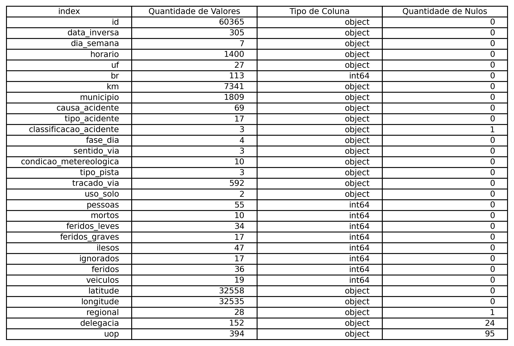   
  

Como mostra a tabela acima, o conjunto de dados está bem estruturado, com as colunas seguindo boas práticas de nomeação e adotando a convenção snake_case (uso de underline). Além do tratamento dos valores nulos, ainda são necessárias algumas etapas de pré-processamento e engenharia de atributos com foco na padronização e consistência dos dados, garantindo que estejam em um formato adequado para as próximas fases da análise.

### Pré-processamento e Engenharia de Atributos  

**Exclusão de colunas desnecessárias**  
Como nosso projeto não inclui estudos regionais sobre localidade dos acidentes ou geolocalização, vamos excluir as colunas:   
*'uf'*,   
*'br'*,   
*'municipio'*,   
*'latitude'*,   
*'longitude'*,   
*'regional'*,   
*'delegacia'*,   
*'uop'*.   

**Conversão dos tipos de dados das colunas**  
Transformar coluna data_acidente e horario em tipo datetime.  

**Tratamento de valores nulos**  
A exclusão da linha com valor nulo é o mais recomendado nesse caso já que foi encontrado apenas uma linha com valores nulos em todo o conjunto   após a exclusão das colunas desnecessárias.  

**Criação de um coeficiente de gravidade - coluna *‘gravidade_coeficiente’***  
Como o conjunto de dados não possui uma coluna específica que representa diretamente o nível de gravidade dos acidentes, foi desenvolvido um   coeficiente de gravidade personalizado. Esse coeficiente tem como objetivo tornar mais clara a análise da severidade dos acidentes a partir das   informações disponíveis.  
O cálculo adotado consiste em uma média ponderada, considerando o impacto relativo de cada tipo de vítima:  

**Variável | Peso**

Veículos: 0.1  
Feridos leves: 1.25  
Feridos graves: 2.5  
Mortes: 5  
  
Assim, o coeficiente de gravidade apresenta a seguinte fórmula:  

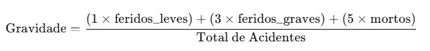   

Criação da coluna *‘gravidade_nivel’*
Baseado no coeficiente de gravidade, vamos criar uma tabela categórica nominal com os níveis de gravidade. Segue o esquema de nivelamento:  

**Coeficiente | Nível**  
  
menor que 0.18    | *‘muito baixo’*
entre 0.18 e 1.88 | *‘baixo’*    
entre 1.88 e 5.28 | *‘médio’*    
entre 5.28 e 10   | *‘alto’*    
acima de 10       | *‘muito alto’*    
  
Com essas novas colunas para mensurar a gravidade dos acidentes, conseguimos criar padrões mais claros e extrair melhor as informações contidas   nos dados.  
  
**Análise Exploratória de Dados**  

**Os acidentes e suas características**  

Os dados de um conjunto quando organizados podem gerar informações valiosas para o entendimento geral do objeto de análise. Vamos visualizar 2   tabelas (numéricas e não numéricas) com o perfil estatístico geral.  
  
*Perfil estatístico descritivo das variáveis não numéricas:*  
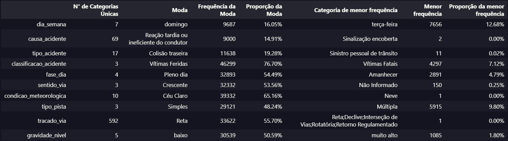  

*Perfil estatístico descritivo das variáveis numéricas:*
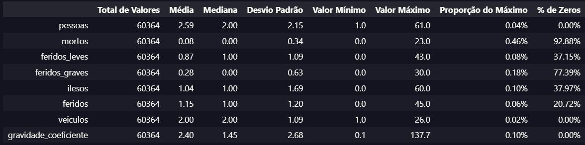  

Com essas informações iniciais, é possível obter uma visão mais clara da composição dos dados, suas relações e proporções.
A tabela das variáveis qualitativas apresenta não apenas os valores modais, suas frequências absolutas e proporções relativas, mas também destaca os valores menos frequentes, oferecendo uma perspectiva abrangente sobre a distribuição dos dados categóricos.  
Por sua vez, a tabela das variáveis quantitativas incorpora ferramentas estatísticas essenciais para análise de distribuição e dispersão, como média, mediana, desvio padrão e proporções, trazendo uma base sólida para interpretações iniciais.  

*Outra visualização importante é a matriz de correlação, que permite identificar o grau de associação entre variáveis numéricas:*
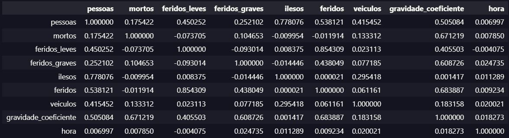

A partir da matriz, podemos avaliar quais variáveis possuem maior influência sobre outras, ajudando a orientar decisões na construção de modelos preditivos ou na interpretação dos dados.  
Nesse primeiro momento, para aprofundar a análise exploratória dos acidentes, definiremos as colunas *‘causa_acidente’* e *‘tipo_acidente’* como variáveis-alvo a começaremos a partir de duas tabelas de frequência com as 15 principais causas e tipos de acidentes no trânsito:  

*Top 15 causas de acidentes*  
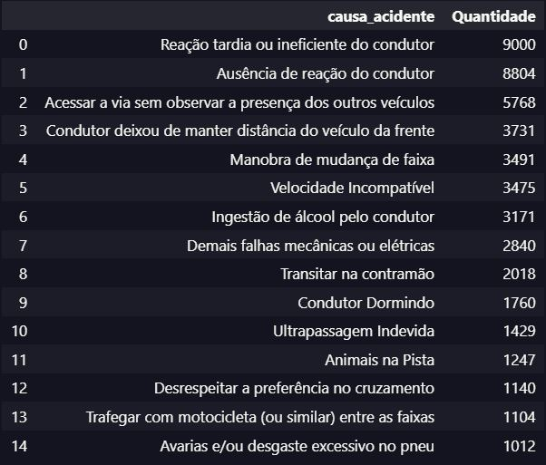   

A tabela com as 15 principais causas de acidentes revela a frequência total de registros no conjunto de dados. Entre as mais recorrentes, destacam-se causas como reação tardia ou ineficiente, ausência de reação, acesso à via sem a devida observação e negligência na manutenção de distância segura entre veículos. Esses fatores apontam fortemente para uma relação com imprudência e desatenção por parte dos condutores. Um dado relevante é que 9 das 10 principais causas estão diretamente ligadas a falhas humanas, reforçando essa conexão.     

*Top 15 tipos de acidentes*   
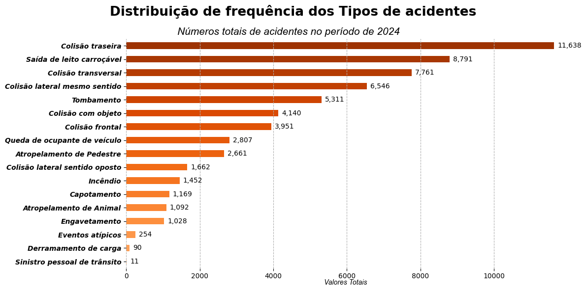 

O gráfico que representa os tipos de acidentes acompanha a mesma tendência: colisão traseira, saída do leito carroçável e colisão transversal estão entre os mais frequentes, sugerindo uma correspondência empírica entre os tipos de acidente e as causas identificadas. Em primeiro lugar com **11.638** registros se encontra o tipo *'Colisão traseira'*, seguido de *'Saída de Leito Carroçável'* e *'Colisão transversal'*, com **8.791** e **7.761**, respectivamente. Esses números mostram um perfil de acidente predominante em uma análise geral.
  
**Gravidade dos Acidentes**  
Seguindo a análise dos tipos de acidentes, se segmentarmos apenas para acidentes graves ou com vítimas fatais, percebemos uma inversão na ordem da frequência:  

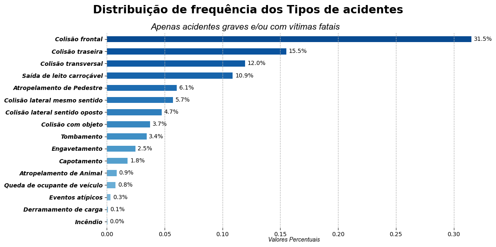 

Quando segmentado acidentes graves e fatais, o tipo *‘Colisão frontal’* aparece em primeiro lugar com pelo menos o dobro de ocorrências que o tipo *‘Colisão traseira’*, que ocupa a segunda posição. O gráfico deixa claro a alta correlação entre acidentes graves/fatais e acidentes do tipo colisão frontal, demonstrando que apesar de o tipo colisão frontal não ser tão recorrente quanto colisão traseira, ele certamente é mais letal.
O mesmo acontece com o gráfico da frequência de causas quando segmentado apenas para acidentes graves e/ou fatais: Transitar na contramão salta da 8° posição para a 1°, evidenciando a letalidade dessa causa específica e mostrando a relação direta entre imprudência e falta de respeito no trânsito com as altas taxas de acidentes graves e fatais.  
  
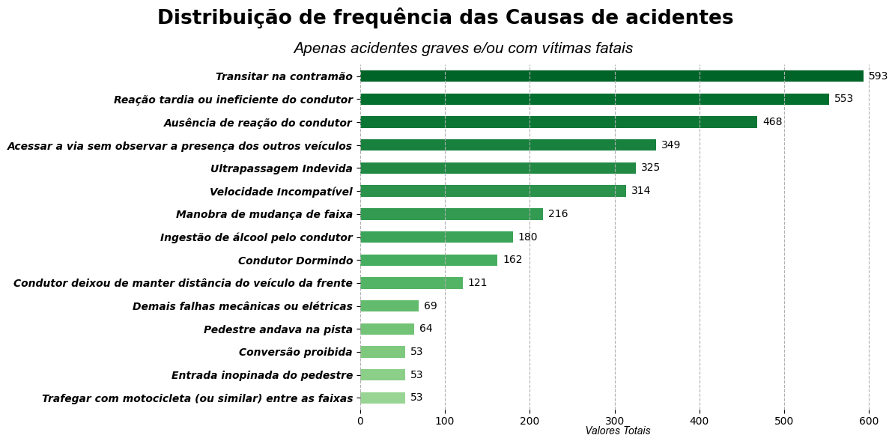   

Boxplots relacionando as variáveis-alvo com o coeficiente de gravidade:  
*Causas x Gravidade*  
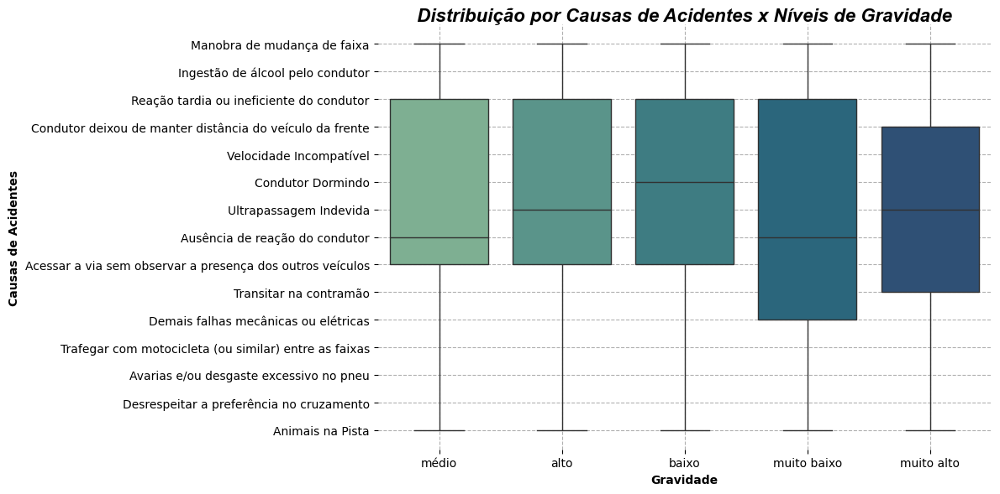 

*Tipos x Gravidade*
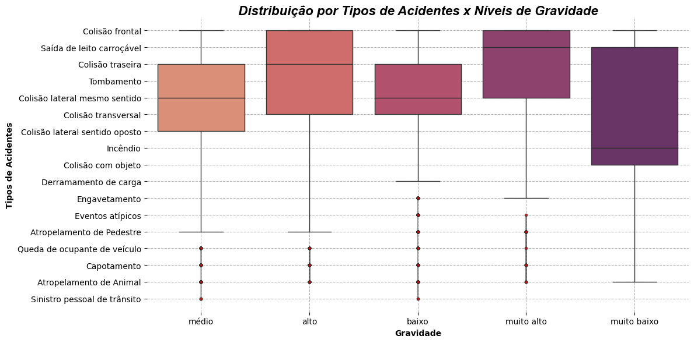   

Vamos criar uma tabela com as 15 principais causas de acidentes, relacionar com os valores modais das demais variáveis categóricas presentes nessas causas e segmentar a tabela apenas para acidentes graves e fatais, ou seja, será considerado apenas acidentes com 1 ou mais vítimas fatais e 1 ou mais vítimas com ferimentos graves:  
  
A tabela mostra que, ao agrupar os dados por causa de acidentes graves ou fatais e calcular a moda das variáveis categóricas, é possível identificar os valores mais recorrentes associados a cada tipo de causa, revelando padrões predominantes.
Algumas colunas, como 'classificacao_acidente', 'condicao_metereologica', 'tracado_via', 'mortos' e 'feridos_graves', apresentam valores hegemônicos nas principais causas de acidentes. Na coluna 'condicao_metereologica' por exemplo, o valor "Céu Claro" está presente em todas as principais causas, porém o fato do valor aparecer com destaque não pode ser interpretado como uma relação de causalidade. A predominância do atributo quando agregado por moda é o reflexo da frequência real dessa condição meteorológica no conjunto de dados, podendo criar um enviesamento na interpretação dos resultados, sendo que essa hegemonia pode ocorrer simplesmente porque a condição meteorológica no nosso país é "Céu Claro", logo a maioria dos acidentes acontecem durante essa condição. O mesmo ocorre na coluna 'classificacao_acidente' onde predomina 'Vítimas Feridas', porque a maioria dos acidentes possui vítimas feridas.
Quando segmentamos dos acidentes apenas os mais graves e fatais, vemos um aumento de ocorrências em condições de ‘Chuva’, ‘Nublado’ e ‘Garoa/Chuvisco’, porém de forma geral, acidentes acontecem em todas as condições meteorológicas, apesar da evidente diferença de frequência quando a condição é ‘Céu claro’: 

A partir dessa ótica, o valor modal desse atributo revelou um contexto comum onde os acidentes ocorrem, e não necessariamente um fator de risco determinante na causa de acidentes.
Considerando uma distribuição proporcional das condições meteorológicas nos tipos dos acidentes:

É possível identificar alguns tipos de acidentes com uma maior probabilidade de acontecer em determinada condição meteorológica. Na chuva, tipos de acidentes como 'Saída de leito carroçável', 'Colisão com objeto', 'Colisão frontal' e 'Colisão lateral sentido oposto' têm uma maior chance de ocorrerem em condição de chuva, fato que pode ser relacionado ao excesso de água na pista, acarretando acidentes do tipo 'Saída do leito carroçável' e 'Colisão lateral sentido oposto'; e à condição de visibilidade, levando à ocorrência de acidentes do tipo 'Colisão frontal', e 'Colisão com objeto'.

Vamos expandir a análise e explorar outras variáveis do conjunto que estão relacionadas com a gravidade dos acidentes:
Gráfico de pizza da Classificação dos Acidentes

O gráfico acima mostra um alto índice de acidentes com ‘Vítimas Feridas’, 7,1% de ‘Vítimas Fatais’ e 16,2% ‘Sem Vítima’, sugerindo que a maioria dos acidentes de trânsito são compostos por pelo menos 1 vítima ferida, sejam elas feridas leves ou graves.
O gráfico de pizza abaixo demonstra essa realidade com a distribuição proporcional da classificação das vítimas envolvidas em acidentes:
Vítimas envolvidas em acidentes

Menos da metade (45,8%) das pessoas envolvidas em acidentes saem ilesas, cerca de 50% dessas pessoas sofrem ferimentos leves ou graves e 3,6% acabam falecendo. Esses dados evidenciam a gravidade da situação nas rodovias, revelando um sistema viário marcado por altos índices de violência e letalidade. 
A contagem de veículos envolvidos em acidentes é de fundamental importância para entendermos os graus de gravidade das ocorrências.

A tabela acima retorna um perfil estatístico dessa variável numérica com ferramentas importantes para a análise inicial.
Acidentes com apenas 2 veículos aparecem como a média e a moda no total de ocorrências, sendo essa a quantidade de veículos mais recorrentes em acidentes, logo após vem os acidentes com 1 veículo, mostrando a correlação que existe entre acidentes com apenas 1 veículo e alguns tipos de acidentes que figuram no topo dos principais, como: ‘Saída de leito carroçável’, ‘Atropelamento de pedestre’ e ‘Tombamento’.

Segundo o gráfico, cerca de 29 mil acidentes envolveram apenas 2 veículos, enquanto aproximadamente 19 mil ocorreram com apenas 1 veículo. Após esses dois principais grupos, observa-se uma queda gradual na frequência, indicando que acidentes com maior número de veículos são progressivamente menos comuns.
Gráfico em escala Logarítmica

O gráfico acima relaciona a gravidade média dos acidentes com a quantidade de veículos envolvidos no acidente e mostra alguns padrões interessantes. A contagem de veículos mantém uma correlação positiva com a gravidade de forma crescente até o número 10, onde há uma queda, chegando a 50% menos de gravidade em relação a números anteriores. Esse pico se repete quando há 15 veículos envolvidos, retrai os mesmos 50% e depois apresenta um aumento exponencial com o aumento de veículos envolvidos.
Para visualizarmos melhor a relação entre a gravidade dos acidentes, distribuição de frequências das vítimas e o número de carros envolvidos, vamos criar um Boxplot com a distribuição: 

A dispersão do índice de gravidade apresenta um padrão marcado por uma alta quantidade de outliers, o que pode levar a interpretações equivocadas dos dados. Embora a presença de muitos pontos fora dos limites interquartis possa sugerir a exclusão desses registros, optamos por não tratá-los como outliers neste projeto.
Apesar de o coeficiente de gravidade ser bastante sensível a valores extremos, consideramos plausível a existência de acidentes com alta variabilidade, o que justifica esses valores fora do comum. Exemplos disso incluem situações como acidentes com muitos feridos leves e nenhum óbito, ou casos com três mortes envolvendo apenas um veículo.

O período do dia em que ocorrem os acidentes influencia diretamente na frequência:

O gráfico acima representa a distribuição total dos acidentes ao longo do dia, sem segmentação por categoria. Ele revela picos de frequência evidentes em horários específicos, como às 7h e às 18h — momentos associados ao deslocamento diário da população para o trabalho ou retorno para casa. Isso sugere uma correlação direta entre o aumento do fluxo de veículos nas ruas e a ocorrência de acidentes.
Ao segmentarmos apenas os acidentes graves ou com vítimas fatais, o padrão de distribuição muda significativamente. Os horários da manhã — 5h, 6h e 7h — apresentam frequências semelhantes entre si, o que reduz a evidência de um pico isolado às 7h. Já no período da tarde, observa-se uma uniformidade entre 14h, 15h e 16h. No entanto, os horários de 17h, 18h e, especialmente, 19h apresentam as maiores frequências do dia, atingindo seu ápice às 19h. Embora não haja dados suficientes para afirmar com precisão as causas desse aumento, é plausível considerar que esse período coincide com o retorno do trabalho, quando o cansaço, o estresse e a pressa podem contribuir para a gravidade dos acidentes.

Outro fator que pesa na gravidade das ocorrências é o tipo de pista, observe:

Fica evidente através do gráfico que o tipo de pista ‘Simples’ representa um nível de gravidade bem acima que dos outros tipos. A partir de um ponto na escala de gravidade, o tipo ‘Simples’ prevalece em todos os horários do dia, deixando claro a importância de uma estrutura viária de qualidade e segurança, por outro lado reafirma a importância de campanhas educativas e de conscientização sobre a atenção e cuidados que a pista simples e com menos estrutura exige.

Processamento de Linguagem Natural

Aplicando algumas técnicas de Processamento de Linguagem Natural, podemos criar uma abordagem simples de análise de texto sobre as causas dos acidentes e observar alguns pontos.
Após o pré-processamento, limpeza e lematização, escolhemos o modelo TF-IDF de vetorização e aplicamos o cosseno de similaridade para o agrupamento semântico das principais causas de acidentes fatais:

É possível observar que as causas com maior letalidade contém termos relacionados principalmente ao fator humano, imprudência e comportamento de risco tanto por parte do condutor quanto do pedestre.

Causas como ‘transitar na contramão’, ‘pedestre andava na pista’, ‘velocidade incompatível’ e ‘ultrapassagem indevida’ tornam evidente a porcentagem majoritária ao fator humano. Outras causas estão relacionadas a possível falta de estrutura e a precariedade do sistema viário, como: ‘ausência de reação do condutor’, ‘reação tardia ou ineficiente do condutor’ ou ‘acessar via sem observar a presença dos outros veículos’. Esses são exemplos de causas que em primeira análise parece estar relacionada apenas ao fator humano, porém a similaridade semântica  as relaciona a fatores como ‘ausência de sinalização’, ‘sinalização mal posicionada’ ou ‘ausência de local apropriado para atravessar rodovia’, demonstrando que a falta de estrutura do sistema viário também é um fator de risco para ocorrência de acidentes fatais.

Segundo o processamento de linguagem natural, é correto afirmar que a condição meteorológica não é fator determinante das causas entre acidentes fatais. Apesar do aumento do risco e da média no coeficiente de gravidade quando a condição é de chuva, a imprudência e o comportamento de risco continuam prevalecendo nessa equação, demonstrando a grande importância de campanhas educativas e ações diretas de combate à imprudência e violência no trânsito.

Recomendações

A partir das informações obtidas nesse projeto, podemos fazer análises descritivas e comparativas sobre os dados dos acidentes no trânsito e propor uma série de ações de intervenções específicas, seja no campo de investimentos em infraestrutura, em campanhas educativas/publicitárias ou ações humanas de fiscalização e conscientização.

Acidentes e suas causas
A análise que fizemos mostrou que as principais causas de acidentes estão relacionadas ao fator humano:
Ausência de reação do condutor: Campanhas educativas  de conscientização  e combate ao uso de celular no trânsito e a importância do descanso para uma condução segura.
Transitar na contramão: Leis rigorosas contra condutores que praticarem ações como trafegar no acostamento ou contramão, assim como o rigor nas ações de conscientização sobre o uso de substâncias psicoativas no trânsito, enfatizando sua proibição e a gravidade dessa infração.
Pedestre andava na pista: Investimento em infraestrutura, como sinalização clara e bem posicionada, passagens claras (faixas e viadutos) para pedestres e qualidade da malha viária.

Infraestrutura Viária
Alguns dos principais acidentes no trânsito tem relação com a falta de infraestrutura e algumas ações podem ser eficazes em mitigar o número de ocorrências:
Duplicação de pista simples: Investimentos na duplicação de vias, especialmente nas rodovias com maior fluxo, podem reduzir colisões frontais e laterais.
Drenagem e pavimentação: Melhorar o escoamento de água e a qualidade do asfalto para reduzir aquaplanagem e perda de controle.
Sinalização Inteligente: Sinalização adaptativa e luminosa em pontos críticos de acidentes mais graves e fatais.

Legislação e Fiscalização 
Algumas ações a serem tomadas:
Tecnologias de monitoramento (radar, sensor e câmera)
Revisão de penas para infrações graves
Fiscalização baseada em dados

Campanhas Segmentadas - Direcionar campanhas específicas para motociclistas, caminhoneiros, motoristas de aplicativos e pedestres.

Tecnologia e Inovação 
A Tecnologia precisa ser uma aliada forte na constante evolução no sistema viário
Planejamento baseado em dados: A produção e o uso contínuos de dados gerados no sistema viário para o aprimoramento constante da infraestrutura.
Integração de dados interinstitucionais: Promover o cruzamento entre dados de outras instituições como o SAMU, Hospitais, DNIT e outros. 

De maneira geral, o combate às principais causas de acidentes fatais no trânsito necessita de campanhas educativas contínuas voltadas ao comportamento seguro, como respeito à sinalização, velocidade compatível e atenção ao tráfego de pedestres, assim como o constante investimento público e ações institucionais com o apoio governamental e da sociedade civil para a manutenção da seguranças dos usuários.

Segurança de Dados
A segurança de Dados na análise relacionados a acidentes de trânsitos é de grande importância e demanda muita atenção. Ainda que realizada com dados públicos e disponíveis, a manipulação exige atenção especial no que diz respeito à segurança e proteção das informações utilizadas.
Apesar de os dados não conterem diretamente informações pessoais, certos campos podem ser considerados sensíveis ou potencialmente identificáveis. Alguns dados presentes em variáveis como data, horário e localização geográfica podem representar risco à privacidade. Latitude e longitude, por exemplo, podem indicar com precisão locais de residência, trabalho ou eventos específicos.
Algumas ações para assegurar a privacidade dos dados analisados precisaram ser feitas durante o desenvolvimento do projeto:
Anonimização dos dados: A localização geográfica como latitude/longitude, estado e município foram excluídas da nossa análise.
Armazenamento seguro: Os arquivos dos dados foram mantidos em ambientes seguros e controlados, apenas resultados das análises serão publicados.
Ética e transparência: As análises foram conduzidas de forma a gerar insights valiosos sobre segurança no trânsito e prevenção de acidentes, evitando qualquer linguagem sensacionalista ou ação fora desse escopo.
O cuidado com a segurança dos dados é essencial para garantir a integridade do trabalho e a confiabilidade da ciência de dados como ferramenta para otimização de políticas públicas. Ao adotar medidas de proteção e anonimização, é possível explorar o potencial analítico dos dados sem comprometer a privacidade dos envolvidos, assegurando uma abordagem ética, legal e socialmente responsável.

Conclusão

O Projeto Integrado trouxe a oportunidade de criar uma análise exploratória de dados de acidentes de trânsito através do conjunto de dados disponibilizado pela Polícia Rodoviária Federal (PRF). Os dados representam uma ferramenta fundamental para a compreensão dos fatores que contribuem para a ocorrência e gravidade dos acidentes. 

A partir da análise do projeto, foi possível adquirir muita informação sobre o tema e através da análise,l gerar muitos insights valiosos para o contexto de negócio.

A incorporação de dados meteorológicos e a análise das causas por meio de Processamento de Linguagem Natural ampliam a capacidade de contextualização e interpretação dos dados, contribuindo para diagnósticos mais precisos. Com isso, este estudo fornece não apenas insumos relevantes para políticas públicas voltadas à segurança no trânsito, como também fortalece a aplicação prática da ciência de dados em problemas sociais concretos.

"""